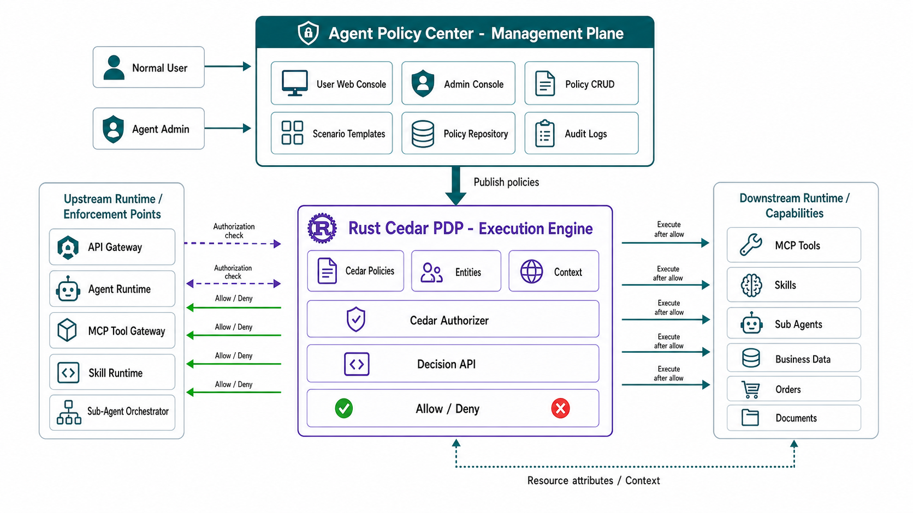
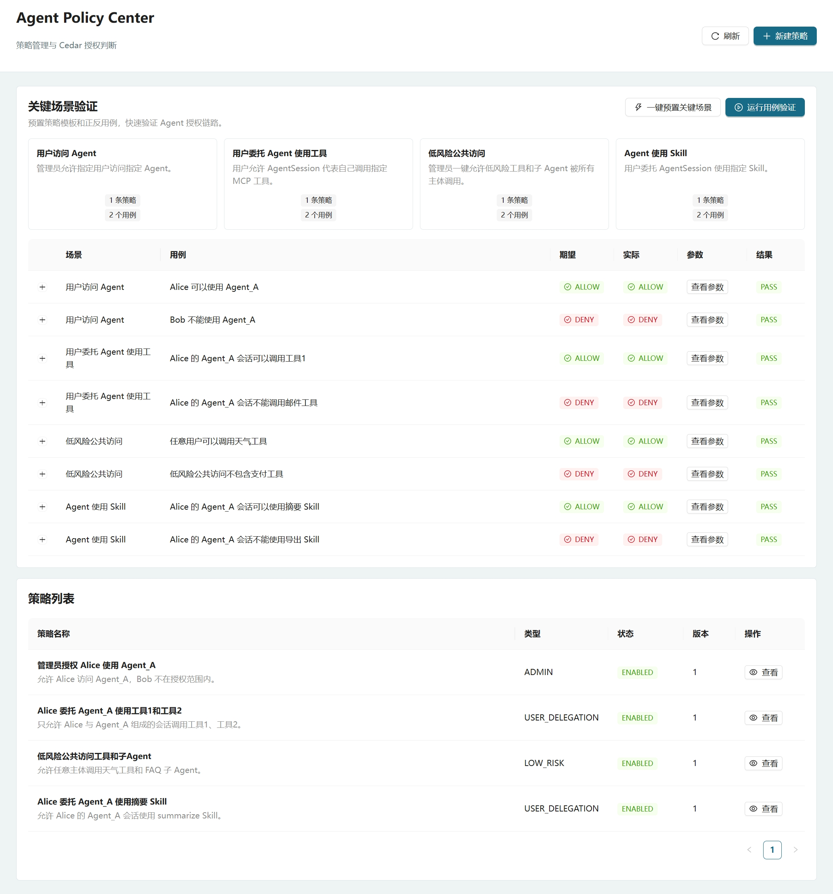
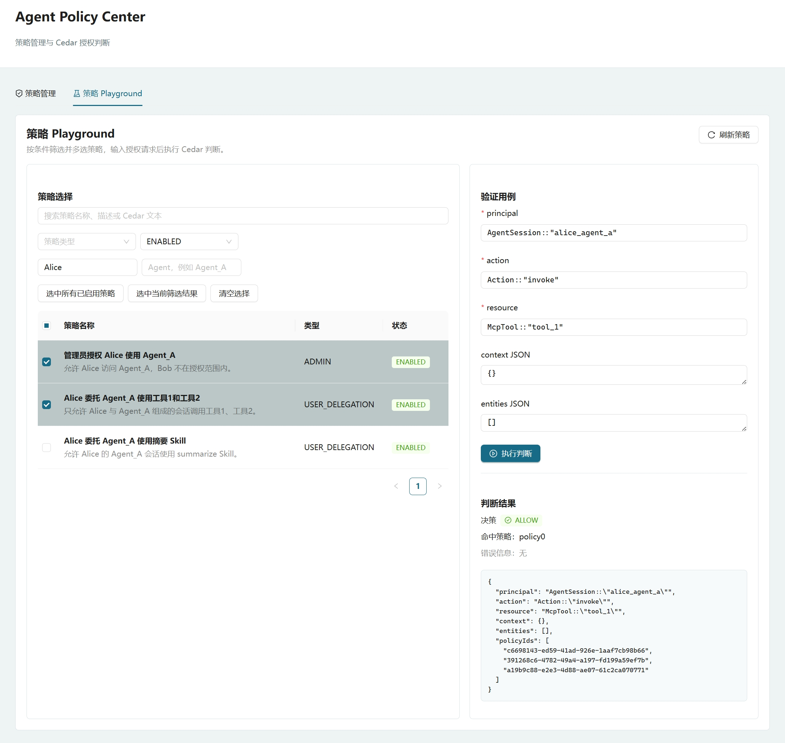

# Agent Policy Center

Agent Policy Center 是一个面向 AI Agent 的策略访问控制原型项目，用于管理和验证以下授权场景：

- 用户访问 Agent。
- 用户允许 Agent 代表自己调用 MCP 工具、Skill、子 Agent。
- Agent 管理员允许用户或用户组访问指定 Agent、工具、Skill、子 Agent。
- 低风险场景下的一键公共访问。

当前实现采用 `Java Policy Center + Rust Cedar PDP Sidecar + React 管理界面` 架构。Java 后端负责策略管理、评估编排和审计；Rust PDP 使用 Cedar 官方 Rust crate 执行真实授权判断；前端提供策略管理、预置关键场景和用例验证能力。

## 技术架构总览



## 项目结构

```text
backend   Java 21 + Spring Boot 后端服务
pdp       Rust Cedar PDP Sidecar
frontend  React + Vite + Ant Design 前端
docs      产品需求、技术方案和开发部署文档
```

## 文档导航

- [AI Agent 策略访问控制中心用户需求文档](docs/superpowers/specs/2026-05-11-agent-policy-access-control-prd.md)：产品背景、目标、授权场景、Cedar 建模规则和验收标准。
- [AI Agent 策略访问控制中心技术方案](docs/superpowers/specs/2026-05-11-agent-policy-java-service-design.md)：Java 后端、前端、策略评估接口和 Cedar 集成设计。
- [Agent Policy Center 开发与部署指导](docs/superpowers/specs/2026-05-11-agent-policy-development-deployment-guide.md)：本地启动、接口验证、PDP sidecar 和常见问题排查。
- [Agent Policy Center v1 实施计划](docs/superpowers/plans/2026-05-11-agent-policy-v1-implementation.md)：第一版任务拆分和实施步骤。
- [背景与目标总览图](docs/assets/agent-policy-background-goals-generated.png)：需求文档第一章配图。

## 环境要求

- JDK 21
- Maven
- Rust / Cargo
- Node.js / npm

快速检查：

```powershell
java -version
mvn -version
rustc --version
cargo --version
node -v
npm -v
```

## 本地启动

建议开三个 PowerShell 窗口，按顺序启动。

### 1. 启动 PDP

```powershell
cd C:\projects\agent-policy\pdp
cargo run
```

默认地址：

```text
http://127.0.0.1:8180
```

健康检查：

```powershell
Invoke-RestMethod http://127.0.0.1:8180/health
```

### 2. 启动后端

```powershell
cd C:\projects\agent-policy\backend
mvn spring-boot:run
```

默认地址：

```text
http://127.0.0.1:8080
```

后端默认调用 PDP：

```text
http://localhost:8180
```

验证：

```powershell
Invoke-RestMethod http://127.0.0.1:8080/api/policies
```

### 3. 启动前端

```powershell
cd C:\projects\agent-policy\frontend
npm install
npm run dev
```

访问地址通常为：

```text
http://127.0.0.1:5173
```

前端已通过 Vite 将 `/api` 代理到 `http://localhost:8080`。

## 常用测试

后端：

```powershell
cd C:\projects\agent-policy\backend
mvn test
```

PDP：

```powershell
cd C:\projects\agent-policy\pdp
cargo test
```

前端：

```powershell
cd C:\projects\agent-policy\frontend
npm test
npm run build
```

## 功能入口

前端当前支持：

- 策略列表。
- 策略新建、详情查看、编辑、删除。
- 一键预置关键场景策略。
- 运行关键场景用例验证。
- 查看用例实际请求参数。

后端主要 API：

- `GET /api/policies`
- `POST /api/policies`
- `GET /api/policies/{id}`
- `PUT /api/policies/{id}`
- `POST /api/policies/{id}/enable`
- `POST /api/policies/{id}/disable`
- `DELETE /api/policies/{id}`
- `POST /api/evaluations`
- `GET /api/evaluations`
- `GET /api/evaluations/{auditId}`

PDP API：

- `GET /health`
- `POST /evaluate`

## 调试提示

- 授权判断返回 `DENY` 时，先确认策略是否已启用。
- Cedar 实体字符串需要使用类似 `User::"Alice"`、`Action::"invoke"`、`McpTool::"weather"` 的格式。
- 如果前端请求失败，先直接访问 `http://127.0.0.1:8080/api/policies` 验证后端是否可用。
- 如果后端评估失败，先访问 `http://127.0.0.1:8180/health` 验证 PDP 是否可用。
- 更完整的开发部署说明见 `docs/superpowers/specs/2026-05-11-agent-policy-development-deployment-guide.md`。

# 演示截图



