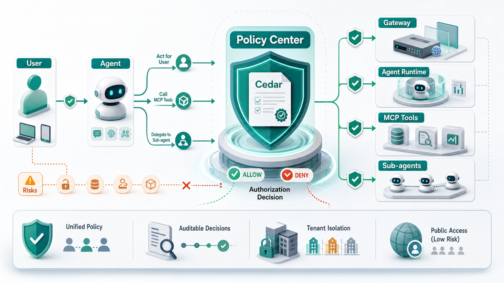

# AI Agent 策略访问控制中心用户需求文档

版本：v0.1  
日期：2026-05-11  
状态：草案  
适用范围：AI Agent 平台第一个版本实现输入

## 1. 背景与目标



随着 AI Agent 能够代表用户执行任务、使用 Skill、调用 MCP 工具、委托子 Agent 协作，平台需要一套统一的策略访问控制能力，避免出现未授权访问、越权能力使用、越权工具调用、跨租户访问、敏感工具滥用等风险。

本项目计划建设一个 **AI Agent 策略访问控制中心**。策略中心使用 [Cedar](https://github.com/cedar-policy/cedar) 作为策略定义、校验和授权判断语言；实际拦截行为由网关、Agent Runtime、MCP 调用层、Agent 编排层等运行时组件执行。

核心目标：

- 统一管理用户、用户组、Agent、Agent 组、Skill、Skill 组、MCP 工具、工具组之间的访问策略。
- 支持用户访问 Agent、Agent 使用 Skill、Agent 访问 MCP 工具、Agent 访问子 Agent 等核心场景。
- 同时支持管理员授权和用户委托授权；Agent 代表用户使用 Skill 或工具时，用户委托授权为必选控制。
- 在低风险场景下支持 Agent 管理员一键允许用户访问所有 Skill、工具和子 Agent，降低管理员配置成本。
- 为后续审计、合规、风险控制和多租户隔离提供基础能力。

非目标：

- 不在 Cedar 中实现认证、登录、身份生命周期管理。
- 不由 Cedar 直接拦截运行时行为；Cedar 只返回授权判断结果。
- v1 不实现复杂审批流、工单流、策略仿真平台或自动策略生成。
- v1 不实现配额、限流、脱敏等执行控制；这些能力可作为授权通过后的附加控制扩展。

## 2. 核心场景

### 2.1 用户访问 Agent

用户通过平台入口访问某个 Agent。策略中心需要判断该用户是否被允许调用目标 Agent。

示例：

- 研发组用户可以访问代码助手 Agent。
- 财务组用户可以访问报销 Agent。
- 某个低风险 FAQ Agent 对所有登录用户开放。
- 平台显式禁止某用户访问某个高风险 Agent。

### 2.2 Agent 调用 MCP 工具

Agent 在执行任务时需要调用 MCP 工具。策略中心需要判断该 Agent 是否可以在当前用户、会话和上下文中调用目标工具。

示例：

- 代码助手 Agent 可以调用代码搜索工具，但不能调用生产发布工具。
- 数据分析 Agent 可以调用只读数据库查询工具。
- 某用户未授权 Agent 代表自己访问日历工具时，Agent 不能调用该工具。
- Agent 代表用户使用任何工具时，都必须存在用户委托授权，避免 Agent 自主执行带来风险。
- 高风险工具还需要同时满足管理员授权和用户委托授权。

### 2.3 Agent 使用 Skill

Agent 在执行任务时可能需要加载或使用某个 Skill。Skill 会影响 Agent 的行为方式、能力边界和可执行流程，因此也需要纳入策略中心控制。

示例：

- 代码助手 Agent 可以使用代码审查 Skill，但不能使用生产变更 Skill。
- 数据分析 Agent 可以使用报表分析 Skill，但不能使用外部数据导出 Skill。
- 某用户未授权 Agent 代表自己使用邮件处理 Skill 时，Agent 不能加载该 Skill 处理用户邮件。
- Agent 代表用户使用任何 Skill 时，都必须存在用户委托授权，避免 Agent 自主改变执行方式或扩大能力边界。
- 高风险 Skill 需要同时满足管理员授权和用户委托授权。

### 2.4 Agent 调用子 Agent

Agent 可以将任务委托给另一个 Agent。策略中心需要判断调用方 Agent 是否可以访问目标子 Agent，并判断当前用户是否允许该委托链代表自己执行。

示例：

- 规划 Agent 可以调用代码实现 Agent。
- 客服 Agent 不允许调用财务审批 Agent。
- 用户可以授权个人助理 Agent 调用日历 Agent，但不授权其调用邮件发送 Agent。

### 2.5 低风险场景

为了保证用户体验，低风险场景下 Agent 管理员可以一键允许用户访问该 Agent 可用的所有 Skill、工具和子 Agent。

低风险场景的含义：

- 管理员创建一条适用范围较大的允许策略，例如某 Agent 可以访问其低风险 Skill 集、低风险工具集和低风险子 Agent 集。
- 该策略解决的是管理员侧授权成本，不替代用户委托授权。
- Agent 代表用户使用 Skill 或工具时，仍必须获得用户对相关 Skill 或工具的委托授权。
- 若平台存在显式禁止策略、租户隔离规则或用户显式拒绝授权，则仍需优先遵守这些约束。

## 3. 授权模型

策略中心采用 Cedar 的 PARC 模型：

- `principal`：访问主体，例如用户、Agent、AgentSession。
- `action`：访问动作，例如访问 Agent、使用 Skill、调用工具、委托子 Agent。
- `resource`：被访问资源，例如 Agent、Skill、MCP 工具、子 Agent。
- `context`：运行时上下文，例如租户、会话、代表用户、风险等级、请求来源。

### 3.1 实体模型

v1 建议支持以下实体类型：

| 实体 | 说明 |
| --- | --- |
| `User` | 平台用户 |
| `UserGroup` | 用户组 |
| `Agent` | 可被用户访问或被其他 Agent 调用的 Agent |
| `AgentGroup` | Agent 分组 |
| `Skill` | Agent 可加载或使用的 Skill |
| `SkillGroup` | Skill 分组 |
| `MCPTool` | MCP 工具 |
| `MCPToolGroup` | MCP 工具分组 |
| `Tenant` | 租户 |
| `AgentSession` | 代表“某 Agent 正在代表某用户执行任务”的一次运行会话主体 |
| `PolicyAdmin` | 策略管理员或 Agent 管理员 |

### 3.2 动作模型

v1 建议支持以下动作：

| 动作 | 说明 |
| --- | --- |
| `invokeAgent` | 用户访问或启动 Agent |
| `useSkill` | Agent 加载或使用 Skill |
| `callTool` | Agent 调用 MCP 工具 |
| `delegateToAgent` | Agent 调用或委托子 Agent |
| `managePolicy` | 管理策略 |
| `grantLowRiskAccess` | 开启低风险场景访问 |
| `revokeAccess` | 关闭或撤销访问 |

### 3.3 上下文模型

v1 建议在授权请求中携带以下上下文：

| 字段 | 说明 |
| --- | --- |
| `tenantId` | 当前租户 |
| `sessionId` | 当前会话 |
| `onBehalfOfUser` | Agent 当前代表的用户；使用 `AgentSession` 作为 `principal` 时，该字段应与 `principal.user` 保持一致 |
| `riskLevel` | 本次访问风险等级，例如 `low`、`medium`、`high` |
| `requestSource` | 请求来源，例如 `web`、`api`、`scheduled_task` |
| `authMode` | 授权模式，例如 `admin_only`、`user_delegated`、`low_risk` |
| `purpose` | 调用目的 |
| `dataSensitivity` | 目标数据、Skill 或工具敏感等级 |

### 3.4 主体建模规则

Cedar 的一次授权请求中只能有一个 `principal`。当业务语义同时涉及用户和 Agent 时，策略中心不应把 `principal` 同时建成两个实体，而应根据访问场景选择主体。

推荐规则：

| 场景 | 推荐 `principal` | 说明 |
| --- | --- | --- |
| 用户直接访问 Agent | `User` | 判断某用户是否可以启动或访问某 Agent |
| Agent 以自身身份执行平台内部动作 | `Agent` | 适用于不代表具体用户的后台动作 |
| Agent 代表用户使用 Skill、工具或子 Agent | `AgentSession` | 表达“某 Agent 正在代表某用户执行”的组合身份 |

`AgentSession` 应至少绑定以下属性：

- `user`：当前被代表的用户。
- `agent`：当前执行任务的 Agent。
- `tenant`：当前租户。
- `sessionId`：当前会话标识。

例如，“A 用户使用 Agent_A 时，只允许使用工具1和工具2”应建模为：

```text
principal = AgentSession::"session_xxx"
action    = Action::"callTool"
resource  = MCPTool::"tool_1"
context   = {
  tenantId: "...",
  sessionId: "session_xxx"
}
```

策略通过 `principal.user` 和 `principal.agent` 同时约束用户与 Agent：

```cedar
permit(
  principal,
  action == Action::"callTool",
  resource
)
when {
  principal.user == User::"A" &&
  principal.agent == Agent::"Agent_A" &&
  (resource == MCPTool::"tool_1" || resource == MCPTool::"tool_2")
};
```

这种方式可以避免“访问主体到底是用户还是 Agent”的歧义，也更适合表达用户委托授权、Agent 管理员授权和运行时会话审计。

### 3.5 授权原则

策略中心应遵循以下原则：

1. **Cedar 只做判断**：Cedar 负责策略表达、策略校验和授权判断，不直接执行拦截。
2. **运行时负责拦截**：网关、Agent Runtime、MCP 调用层、Agent 编排层必须在关键调用前请求策略中心，并根据结果允许或拒绝。
3. **默认拒绝**：没有任何适用允许策略时，访问默认拒绝。
4. **显式拒绝优先**：任何命中的显式禁止策略都应覆盖允许策略。
5. **策略维度分场景要求**：用户访问 Agent 时，用户委托策略不是必选；Agent 代表用户使用 Skill 或工具时，用户委托策略是必选。
6. **存在即约束**：如果某个维度存在适用策略，则该维度必须返回允许。
7. **双重授权**：当管理员策略和用户委托策略同时适用于同一请求时，必须同时允许。
8. **低风险场景简化**：Agent 管理员可为低风险 Skill、工具或子 Agent 开启一键访问授权，使用户访问 Agent 后不需要管理员逐项配置每个 Skill、工具和子 Agent。
9. **用户委托不被替代**：低风险场景的一键授权只简化管理员侧策略，不替代用户允许 Agent 代表自己使用 Skill 或工具的授权。
10. **租户隔离优先**：任何访问都必须限制在合法租户边界内，跨租户访问默认拒绝。

### 3.6 推荐判定流程

运行时组件发起授权请求后，策略中心按以下逻辑处理：

1. 根据访问场景选择 `principal`：用户直接访问 Agent 使用 `User`；Agent 代表用户执行时使用 `AgentSession`；Agent 自身后台动作使用 `Agent`。
2. 构造 Cedar 授权请求：`principal`、`action`、`resource`、`context`。
3. 加载当前租户、用户、Agent、AgentSession、Skill、工具及其分组关系对应的实体数据。
4. 先判断是否存在平台级或租户级显式禁止策略；若命中则拒绝。
5. 判断是否存在适用的管理员授权策略；若存在，则必须允许。
6. 若请求是 Agent 代表用户使用 Skill 或工具，则必须存在适用的用户委托允许策略，否则拒绝。
7. 若请求是 Agent 代表用户调用子 Agent，且该子 Agent 会继续使用用户数据、Skill 或工具，则必须存在适用的用户委托允许策略。
8. 对非必选用户委托场景，若存在适用的用户委托策略，则必须允许。
9. 若管理员策略和用户委托策略都不适用，且不存在低风险场景一键访问策略，则拒绝。
10. 若至少一个策略维度适用且所有必选或适用维度均允许，则允许。
11. 返回授权结果、命中策略、拒绝原因和审计字段。

## 4. Cedar 适配性分析

Cedar 是面向应用授权的开源策略语言，适合表达“谁可以对什么资源执行什么动作，并在什么条件下允许”。其能力与本项目需求匹配度较高。

### 4.1 能力匹配

| Cedar 能力 | 对本项目的价值 |
| --- | --- |
| PARC 授权模型 | 可直接表达用户访问 Agent、Agent 使用 Skill、Agent 调用工具、Agent 调用 Agent |
| 默认拒绝 | 符合安全基线 |
| `permit` / `forbid` | 可表达允许策略和显式禁止策略 |
| RBAC | 支持用户组、Agent 组、Skill 组、工具组授权 |
| ABAC | 支持基于属性、风险等级、租户、数据敏感度的条件授权 |
| 实体层级 | 支持 `User in UserGroup`、`Skill in SkillGroup`、`Tool in ToolGroup`、`Agent in AgentGroup` |
| Action Group | 支持动作分组，例如只读工具动作、管理员动作 |
| Schema 校验 | 可降低策略引用错误实体、动作、属性的风险 |
| Policy Template | 可沉淀常用策略模板，例如低风险场景授权、用户组访问、工具组授权 |

### 4.2 适合表达的策略

Cedar 适合表达：

- 某用户组是否可以访问某 Agent。
- 某 Agent 是否可以使用某 Skill 或 Skill 组。
- 某 Agent 是否可以调用某工具组。
- 某 Agent 是否可以委托某子 Agent。
- 某用户是否允许 Agent 代表自己使用某 Skill 或调用某工具。
- 某租户内资源是否允许被访问。
- 某风险等级下是否禁止访问高敏感资源。

示例策略，所有登录用户可访问低风险 FAQ Agent：

```cedar
permit(
  principal in UserGroup::"all_authenticated_users",
  action == Action::"invokeAgent",
  resource == Agent::"faq_agent"
)
when {
  resource.riskLevel == "low"
};
```

示例策略，用户允许某 Agent 代表自己调用日历工具：

```cedar
permit(
  principal,
  action == Action::"callTool",
  resource == MCPTool::"calendar_read"
)
when {
  principal.user == User::"user_123" &&
  principal.agent == Agent::"personal_assistant"
};
```

示例策略，用户允许某 Agent 代表自己使用邮件处理 Skill：

```cedar
permit(
  principal,
  action == Action::"useSkill",
  resource == Skill::"email_triage"
)
when {
  principal.user == User::"user_123" &&
  principal.agent == Agent::"personal_assistant"
};
```

示例策略，平台禁止任何 Agent 调用生产发布工具：

```cedar
forbid(
  principal,
  action == Action::"callTool",
  resource == MCPTool::"prod_deploy"
);
```

### 4.3 Cedar 边界

Cedar 不能单独完成以下能力：

- 用户认证、Agent 身份认证、MCP 工具身份认证。
- 运行时拦截、调用阻断、工具调用回滚。
- 审批流、工单流、授权申请流程。
- 策略版本发布、灰度、回滚、审计查询。
- 配额、限流、脱敏、水印、二次确认等执行控制。

这些能力需要由策略中心平台和运行时组件共同实现。

参考来源：

- Cedar GitHub: https://github.com/cedar-policy/cedar
- Cedar 官方文档: https://docs.cedarpolicy.com/
- Cedar 授权模型: https://docs.cedarpolicy.com/auth/authorization.html
- Cedar Schema: https://docs.cedarpolicy.com/schema/schema.html
- Cedar crate 文档: https://docs.rs/crate/cedar-policy/latest

## 5. 策略中心功能需求

### 5.1 策略管理

策略中心应支持：

- 创建、编辑、删除、启用、停用策略。
- 按租户、Agent、Skill、工具、用户组、策略类型查询策略。
- 区分管理员策略、用户委托策略、平台禁止策略、低风险场景策略。
- 支持策略版本管理和回滚。
- 支持策略发布前校验。
- 支持策略命中审计。

### 5.2 策略模板

v1 应提供常用模板：

- 用户组访问 Agent。
- 用户访问指定 Agent。
- Agent 使用 Skill 组。
- Agent 使用指定 Skill。
- Agent 调用工具组。
- Agent 调用指定 MCP 工具。
- Agent 委托子 Agent。
- 用户允许 Agent 代表自己使用 Skill。
- 用户允许 Agent 代表自己调用工具。
- 用户允许 Agent 代表自己调用子 Agent。
- 低风险场景下 Agent 可访问 Skill 组、工具组和子 Agent 组。
- 显式禁止访问高风险工具。

### 5.3 低风险场景授权

Agent 管理员应可以在低风险场景下一键允许用户访问某 Agent 可用的所有 Skill、工具和子 Agent。

低风险场景授权要求：

- 必须记录开启人、开启时间、适用范围、风险等级、原因。
- 默认仅允许低风险 Skill、低风险 Skill 组、低风险工具、低风险工具组、低风险子 Agent、低风险 Agent 组使用一键授权。
- 对中高风险资源不得使用一键低风险授权；如需开放，必须创建显式管理员授权策略。
- 低风险场景授权只代表管理员允许 Agent 使用这些 Skill、工具和子 Agent，不代表用户已经允许 Agent 代表自己使用 Skill 或工具。
- Agent 代表用户使用 Skill 或调用工具时，必须继续校验用户委托授权。
- 低风险场景策略仍受平台级显式禁止策略、租户隔离和用户显式拒绝约束。

### 5.4 策略校验

策略发布前必须校验：

- Cedar 语法是否合法。
- 策略引用的实体类型、动作、属性是否符合 Schema。
- 是否存在跨租户资源引用。
- 是否存在明显高风险配置，例如对高敏感工具开放所有用户。
- Agent 代表用户使用 Skill 或调用工具的策略链路是否包含用户委托授权。
- 是否与平台强制禁止策略冲突。

### 5.5 授权决策服务

策略中心应提供运行时授权判断能力：

- 输入：主体、动作、资源、上下文。
- 输出：允许或拒绝。
- 输出命中的允许策略、禁止策略、策略版本、拒绝原因。
- 支持低延迟调用。
- 支持批量判断，用于 Agent 规划阶段提前过滤可用 Skill、工具和子 Agent。

## 6. 运行时集成需求

### 6.1 集成点

v1 至少需要在以下位置集成授权判断：

| 集成点 | 授权动作 | 拦截责任 |
| --- | --- | --- |
| 用户入口网关 | `invokeAgent` | 判断用户是否可访问目标 Agent |
| Skill 加载层 | `useSkill` | 判断当前 Agent 是否可加载或使用目标 Skill |
| Agent Runtime | `callTool` | 判断当前 Agent 是否可调用目标 MCP 工具 |
| MCP 调用层 | `callTool` | 在真实工具调用前做最终拦截 |
| Agent 编排层 | `delegateToAgent` | 判断 Agent 是否可调用目标子 Agent |
| 策略管理后台 | `managePolicy` | 判断管理员是否可管理策略 |

### 6.2 授权请求要求

运行时组件必须提供完整上下文：

- 当前用户身份。
- 当前 Agent 身份。
- 目标资源身份。
- 当前租户。
- 当前会话。
- 是否代表用户执行。
- Skill、工具或 Agent 的风险等级。
- 数据敏感等级。
- 请求来源。

上下文缺失时，策略中心应默认拒绝高风险请求；低风险请求是否允许降级处理由平台配置决定。

### 6.3 授权失败处理

授权失败时，运行时组件应：

- 阻断当前调用。
- 返回可理解但不泄露敏感策略细节的错误信息。
- 记录审计日志。
- 对 Agent 返回结构化失败原因，便于 Agent 选择替代工具或结束任务。

### 6.4 可用工具过滤

为提升用户体验，Agent 在规划任务前可请求策略中心返回当前上下文下可用的 Skill、工具和子 Agent 列表。

要求：

- Skill、工具和子 Agent 列表必须基于同一套策略判断。
- 可用列表只能作为规划辅助，真实使用或调用前仍必须再次授权。
- Skill、工具或子 Agent 权限变化后，缓存必须及时失效。

## 7. 非功能需求与风险

### 7.1 性能与可用性

- 授权判断应满足低延迟要求，避免明显影响 Agent 调用链路。
- 策略中心应支持本地缓存、策略快照或边缘 PDP，以降低中心服务故障影响。
- 高风险动作在策略中心不可用时应默认拒绝。
- 低风险动作是否允许短时间使用缓存结果，需要由平台配置控制。

### 7.2 安全与审计

- 所有授权判断必须记录审计日志。
- 审计日志至少包含主体、动作、资源、上下文摘要、结果、命中策略、策略版本、时间、请求来源。
- 策略变更必须记录操作人、变更内容、发布时间和回滚记录。
- 策略管理员权限必须被策略中心自身控制。
- 租户隔离必须作为强制规则。

### 7.3 风险

主要风险：

- 策略配置过于复杂，导致管理员难以理解实际效果。
- 用户委托授权是 Skill 和工具使用的必选控制，若交互设计过重，会影响 Agent 使用体验。
- 低风险场景一键授权配置不当，导致低风险资源边界扩大。
- 运行时组件未在关键路径接入授权判断，导致策略绕过。
- 实体数据不同步，导致授权判断结果不准确。
- Cedar 能表达授权规则，但不能表达所有执行控制，需要平台层扩展。

缓解措施：

- v1 优先提供模板化策略，减少直接手写 Cedar 的场景。
- 为低风险场景授权、用户委托授权、显式禁止、高风险 Skill 和高风险工具提供清晰的 UI 标识和审计。
- 强制关键运行时路径接入策略中心。
- 引入策略发布前校验和发布后审计。
- 对高风险 Skill 和高风险工具采用默认拒绝和显式授权。

### 7.4 v1 验收标准

v1 完成时，应至少满足：

- 可以定义用户、用户组、Agent、Agent 组、Skill、Skill 组、MCP 工具、工具组实体。
- 可以创建并发布 Cedar 策略。
- 可以通过策略中心判断用户是否能访问 Agent。
- 可以判断 Agent 是否能使用 Skill。
- 可以判断 Agent 是否能调用 MCP 工具。
- 可以判断 Agent 是否能委托子 Agent。
- 可以表达管理员授权和用户委托授权同时满足的场景。
- 可以强制要求 Agent 代表用户使用 Skill 或调用工具时必须具备用户委托授权。
- 可以配置低风险场景下 Agent 对 Skill、工具和子 Agent 的一键管理员授权。
- 可以执行显式禁止策略并覆盖允许策略。
- 可以输出授权判断日志和策略命中信息。
- 至少一个网关或 Runtime 原型完成真实拦截集成。
