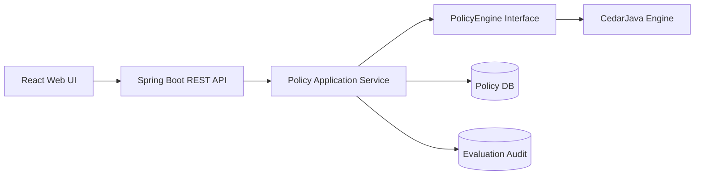

# AI Agent 策略访问控制中心技术方案

版本：v0.1  
日期：2026-05-11  
状态：草案  
适用范围：第一个可运行版本实现输入  
关联需求文档：`docs/superpowers/specs/2026-05-11-agent-policy-access-control-prd.md`

## 1. 目标与范围

本方案用于实现一个前后端分离的 AI Agent 策略访问控制中心。系统提供基础 Web 管理界面和 Java 微服务，支持策略定义、策略管理和策略判断。

v1 目标：

- 提供策略 CRUD：创建、查询、编辑、删除、启用、停用。
- 支持 Cedar 策略文本保存、版本记录和基础校验。
- 提供策略判断 Playground：输入 `principal`、`action`、`resource`、`context`、`entities` 后返回 Allow/Deny。
- 支持用户、Agent、AgentSession、Skill、MCPTool、子 Agent 等授权场景的请求建模。
- 记录策略判断审计日志，包括请求、结果、命中策略和错误信息。
- 提供前后端分离的基础 Web 界面，满足研发和产品评审使用。

v1 非目标：

- 不实现完整登录认证体系，可预留 Spring Security 接入点。
- 不实现复杂审批流、策略灰度发布、策略仿真平台。
- 不实现运行时网关拦截，只提供可被网关或 Agent Runtime 调用的授权判断 API。
- 不实现完整可视化策略编辑器，v1 允许用户直接编辑 Cedar 文本。

## 2. 技术选型

### 2.1 后端

后端采用 Java 21 + Maven + Spring Boot 3。

推荐依赖：

| 类型 | 技术 |
| --- | --- |
| Web 框架 | Spring Boot 3, Spring Web |
| 参数校验 | Spring Validation |
| 数据访问 | Spring Data JPA |
| 数据库 | H2 for dev, PostgreSQL for production |
| 数据库迁移 | Flyway |
| 授权引擎 | CedarJava |
| JSON 处理 | Jackson |
| 测试 | JUnit 5, AssertJ, Testcontainers |
| 构建 | Maven |

Cedar 集成优先使用官方 Java 绑定 [cedar-java](https://github.com/cedar-policy/cedar-java)。由于 Java 绑定可能落后于 Rust 主实现，后端必须通过 `PolicyEngine` 接口隔离 Cedar 调用，保留后续切换到 Rust PDP sidecar 或 Cedar Local Agent 的空间。

### 2.2 前端

前端采用 React + TypeScript + Vite + Ant Design。

推荐依赖：

| 类型 | 技术 |
| --- | --- |
| 前端框架 | React + TypeScript |
| 构建工具 | Vite |
| UI 组件 | Ant Design |
| 路由 | React Router |
| 服务端状态 | TanStack Query |
| 编辑器 | Monaco Editor |
| HTTP 客户端 | Axios |
| 表单辅助 | Ant Design Form, Zod |
| 测试 | Vitest |

选择 Ant Design 的原因：

- 项目是典型中后台系统，策略表格、表单、弹窗、审计列表和结果面板是核心界面。
- Ant Design 的 Table、Form、Modal、Drawer、Tabs、Layout、Alert 等组件成熟，能降低 v1 UI 交付风险。
- 前端重点应放在策略编辑和授权判断体验，不应把过多时间投入基础组件拼装。

### 2.3 项目结构

建议采用 monorepo：

```text
agent-policy/
  backend/
    pom.xml
    src/main/java/...
    src/main/resources/...
  frontend/
    package.json
    vite.config.ts
    src/
      api/
      components/
      pages/
      routes/
      types/
  docs/
```

开发端口：

| 服务 | 地址 |
| --- | --- |
| 后端 API | `http://localhost:8080` |
| 前端 Web | `http://localhost:5173` |

## 3. 总体架构



### 3.1 后端模块

| 模块 | 职责 |
| --- | --- |
| `policy-api` | REST Controller，请求响应 DTO |
| `policy-service` | 策略管理、策略版本、策略启停 |
| `decision-service` | 授权判断、审计记录、结果转换 |
| `cedar-engine` | CedarJava 适配，实现 `PolicyEngine` |
| `audit-service` | 判断日志查询 |
| `persistence` | JPA Entity、Repository、Flyway 脚本 |

### 3.2 前端模块

| 模块 | 职责 |
| --- | --- |
| `pages/PolicyList` | 策略列表、筛选、启停、删除 |
| `pages/PolicyEditor` | 新建和编辑策略 |
| `pages/EvaluatePlayground` | 策略判断输入与结果展示 |
| `pages/AuditLog` | 判断审计日志 |
| `components/CedarEditor` | Cedar 文本编辑器，基于 Monaco |
| `components/JsonEditor` | context/entities JSON 编辑器，基于 Monaco |
| `api/*` | Axios API 封装 |

## 4. 数据模型

### 4.1 策略表

`policy`

| 字段 | 类型 | 说明 |
| --- | --- | --- |
| `id` | UUID | 主键 |
| `name` | varchar | 策略名称 |
| `description` | text | 策略描述 |
| `policy_type` | varchar | `ADMIN`、`USER_DELEGATION`、`FORBID`、`LOW_RISK` |
| `cedar_text` | text | Cedar 策略文本 |
| `status` | varchar | `DRAFT`、`ENABLED`、`DISABLED` |
| `version` | int | 当前版本 |
| `created_at` | timestamp | 创建时间 |
| `updated_at` | timestamp | 更新时间 |

### 4.2 策略版本表

`policy_version`

| 字段 | 类型 | 说明 |
| --- | --- | --- |
| `id` | UUID | 主键 |
| `policy_id` | UUID | 策略 ID |
| `version` | int | 版本号 |
| `cedar_text` | text | 该版本策略文本 |
| `change_note` | text | 变更说明 |
| `created_at` | timestamp | 创建时间 |

### 4.3 授权判断审计表

`evaluation_audit`

| 字段 | 类型 | 说明 |
| --- | --- | --- |
| `id` | UUID | 主键 |
| `principal` | varchar | 授权主体 |
| `action` | varchar | 授权动作 |
| `resource` | varchar | 授权资源 |
| `context_json` | json/text | 上下文 |
| `entities_json` | json/text | 实体数据 |
| `decision` | varchar | `ALLOW` 或 `DENY` |
| `matched_policies` | text | 命中策略 ID 列表 |
| `error_message` | text | 错误信息 |
| `created_at` | timestamp | 创建时间 |

v1 可不单独落库 User、Agent、Skill、MCPTool 等实体目录，先由 Playground 或调用方传入 `entities` JSON。后续版本再建设实体目录管理。

## 5. API 与 Web 页面设计

### 5.1 策略管理 API

```text
GET    /api/policies
POST   /api/policies
GET    /api/policies/{id}
PUT    /api/policies/{id}
DELETE /api/policies/{id}
POST   /api/policies/{id}/enable
POST   /api/policies/{id}/disable
GET    /api/policies/{id}/versions
POST   /api/policies/validate
```

### 5.2 策略判断 API

```text
POST   /api/evaluations
GET    /api/evaluations/{id}
GET    /api/evaluations
```

`POST /api/evaluations` 请求示例：

```json
{
  "principal": "AgentSession::\"session_001\"",
  "action": "Action::\"callTool\"",
  "resource": "MCPTool::\"tool_1\"",
  "context": {
    "tenantId": "tenant_001",
    "sessionId": "session_001",
    "riskLevel": "low"
  },
  "entities": [
    {
      "uid": "AgentSession::\"session_001\"",
      "attrs": {
        "user": "User::\"A\"",
        "agent": "Agent::\"Agent_A\"",
        "tenant": "Tenant::\"tenant_001\""
      },
      "parents": []
    }
  ],
  "policyIds": []
}
```

响应示例：

```json
{
  "decision": "ALLOW",
  "matchedPolicies": ["policy-001"],
  "errors": [],
  "auditId": "audit-001"
}
```

### 5.3 Web 页面

| 页面 | 路径 | 功能 |
| --- | --- | --- |
| 策略列表 | `/policies` | 查询、筛选、启停、删除 |
| 策略编辑 | `/policies/new`, `/policies/:id/edit` | Cedar 编辑、保存、校验 |
| 策略判断 | `/evaluate` | 输入请求和实体 JSON，执行判断 |
| 审计日志 | `/audits` | 查看历史判断记录 |

策略判断页面建议分为三栏：

- 左侧：`principal`、`action`、`resource` 表单。
- 中间：`context` 与 `entities` JSON 编辑器。
- 右侧：Allow/Deny 结果、命中策略、错误信息。

## 6. Cedar 集成设计

### 6.1 PolicyEngine 接口

后端业务层只依赖 `PolicyEngine`，不直接依赖 CedarJava。

```java
public interface PolicyEngine {
    PolicyValidationResult validate(String cedarPolicyText);

    PolicyDecisionResult evaluate(PolicyDecisionRequest request);
}
```

### 6.2 CedarJavaPolicyEngine

`CedarJavaPolicyEngine` 负责：

- 将启用策略组装为 Cedar `PolicySet`。
- 将 `principal`、`action`、`resource` 转换为 Cedar 请求。
- 将 `context` JSON 转换为 Cedar 上下文。
- 将 `entities` JSON 转换为 Cedar 实体集合。
- 调用 CedarJava 授权判断。
- 将 Cedar 返回值转换为平台统一结果。

### 6.3 用户 + Agent 组合主体

当 Agent 代表用户使用 Skill、MCP 工具或子 Agent 时，`principal` 使用 `AgentSession`。

示例：

```text
principal = AgentSession::"session_001"
action    = Action::"callTool"
resource  = MCPTool::"tool_1"
```

策略中通过 `principal.user` 和 `principal.agent` 同时约束用户和 Agent：

```cedar
permit(
  principal,
  action == Action::"callTool",
  resource == MCPTool::"tool_1"
)
when {
  principal.user == User::"A" &&
  principal.agent == Agent::"Agent_A"
};
```

### 6.4 校验策略

v1 校验分两层：

- 基础校验：策略非空、Cedar 语法可解析。
- 业务校验：策略类型、状态、风险标记、用户委托必选场景检查。

Schema 校验预留 `SchemaValidationService` 接口。如果 CedarJava 当前版本满足 Schema 校验需求，则直接接入；否则 v1 先完成接口和基础语法校验，后续通过升级 CedarJava、Rust CLI 或 sidecar 实现完整 Schema 校验。

## 7. v1 实现计划与风险

### 7.1 实现顺序

1. 初始化 monorepo：`backend`、`frontend`。
2. 搭建 Spring Boot 3 + Java 21 + Maven 后端。
3. 增加 Flyway、JPA、H2/PostgreSQL 配置。
4. 实现策略 CRUD API。
5. 接入 CedarJava，实现 `PolicyEngine` 基础判断。
6. 实现授权判断 API 和审计日志。
7. 搭建 React + Vite + Ant Design 前端。
8. 实现策略列表、策略编辑、策略判断、审计日志页面。
9. 增加单元测试和端到端手工验证样例。

### 7.2 关键风险

| 风险 | 影响 | 应对 |
| --- | --- | --- |
| CedarJava 版本落后 Rust 主实现 | 部分新特性不可用 | 通过 `PolicyEngine` 隔离，保留 sidecar 替换空间 |
| Cedar 实体 JSON 转换复杂 | 判断结果不稳定 | v1 提供固定示例和严格请求格式 |
| 策略语法错误导致判断失败 | 影响体验 | 保存前校验，判断失败返回结构化错误 |
| 用户委托授权规则被绕过 | 安全风险 | 在业务层对 `useSkill`、`callTool` 强制检查 `AgentSession` |
| 前端编辑 Cedar/JSON 容易输错 | 影响使用 | Monaco Editor + 示例模板 + JSON 校验 |

### 7.3 v1 验收标准

- 后端可启动，提供策略 CRUD API。
- 前端可启动，能管理策略。
- 可以创建 Cedar 策略并执行基础校验。
- 可以输入 `principal`、`action`、`resource`、`context`、`entities` 执行判断。
- 可以使用 `AgentSession` 表达用户 + Agent 组合主体。
- 可以返回 Allow/Deny、命中策略和错误信息。
- 可以记录并查询授权判断审计日志。
- 至少覆盖用户访问 Agent、Agent 使用 Skill、Agent 调用 MCP 工具三个样例。

